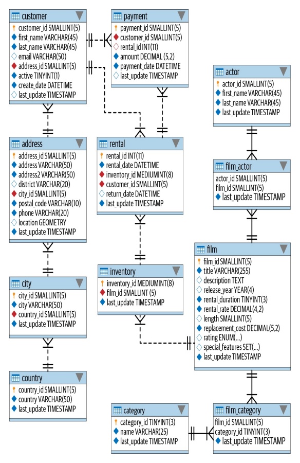

# Chapter 2. Creating and Populating a Database

## Creating a MySQL Database

Run `.sql` file from `sakila-db` server

## Using the mysql Command-Line Tool

1. Logging in from Windows shell
    ```
   mysql -u root -p;
   ```

2. See all the available databases
    ```
   show databases;
   ```

3. Specify the database to work with
    ```
   use sakila;
   ```

4. Clear window screen
   ```
   mysql> \! cls
   ```

## MySQL Data Types

### Character Data

    char(20)    /* fixed-length */
    varchar(20) /* variable-length */

- `tinytext` - 255 bytes

- `text` - 65535 bytes (`clob` in _Oracle Database_)

- `mediumtext` - 16777215 bytes

- `longtext` - 4294967295 bytes

### Numeric Data

#### MySQL integer types

- `tinyint` - -128 to 127

- `smallint` - -32,768 to 32,767

- `mediumint` - -8,388,608 to 8,388,607

- `int` - −2,147,483,648 to 2,147,483,647

- `bigint` - -2^63 to 2^63 - 1

#### MySQL floating-point types

- `float(p, s)` and `double(p, s)`

> For example, a column defined as float(4,2) will store a total of four digits, two to the left of the decimal and two
> to the right of the decimal. Therefore, such a column would handle the numbers 27.44 and 8.19 just fine, but the
> number
> 17.8675 would be rounded to 17.87, and attempting to store the number 178.375 in your float(4,2) column would generate
> an error.

### Temporal Data

- `date` - YYYY-MM-DD

  Columns to hold the expected future shipping date of a customer order and an employee’s birthdate would use the date
  type, since it is unrealistic to schedule a future shipment down to the second and unnecessary to know at what time a
  person was born.
- `datetime` - YYYY-MM-DD HH:MI:SS

  A column to hold information about when a customer order was actually shipped would use the datetime type, since it is
  important to track not only the date that the shipment occurred but the time as well.
- `timestamp` - YYYY-MM-DD HH:MI:SS

  A column that tracks when a user last modified a particular row in a table would use the timestamp type. The timestamp
  type holds the same information as the datetime type (year, month, day, hour, minute, second), but a timestamp column
  will automatically be populated with the current date/time by the MySQL server when a row is added to a table or when
  a row is later modified.
- `year` - YYYY

  A column holding just year data would use the year type.
- `time` - HHH:MI:SS

  Columns that hold data regarding the length of time needed to complete a task would use the time type. For this type
  of data, it would be unnecessary and confusing to store a date component, since you are interested only in the number
  of hours/minutes/seconds needed to complete the task. This information could be derived using two datetime columns (
  one for the task start date/time and the other for the task completion date/time) and subtracting one from the other,
  but it is simpler to use a single time column.

## Table Creation

### SQL Schema Statements

1. Person Table
   ```
   CREATE TABLE person (
      person_id SMALLINT UNSIGNED,
      fname VARCHAR(20),
      lname VARCHAR(20),
      eye_color ENUM('BR', 'BL', 'GR'), /* eye_color CHAR(2) CHECK (eye_color IN ('BR','BL','GR')), */
      birth_date DATE,
      street VARCHAR(30),
      city VARCHAR(20),
      state VARCHAR(20),
      country VARCHAR(20),
      postal_code VARCHAR(20),
      CONSTRAINT pk_person PRIMARY KEY (person_id)
   );
   ```

   ```
   mysql> desc person;
   ```

2. Favorite_food Table
   ```
   CREATE TABLE favorite_food (
      person_id SMALLINT UNSIGNED,
      food VARCHAR(20),
      CONSTRAINT pk_favorite_food PRIMARY KEY (person_id, food),
      CONSTRAINT fk_fav_food_person_id FOREIGN KEY (person_id) REFERENCES person (person_id)
   );
   ```

## Population and Modifying Tables

### Inserting Data

#### Generating Numeric Key Data

   ```
   ALTER TABLE person
   MODIFY person_id SMALLINT UNSIGNED AUTO_INCREMENT;
   ```

#### The INSERT Statement

   ```
   INSERT INTO person
   (person_id, fname, lname, eye_color, birth_date)
   VALUES (null, 'William', 'Turner', 'BR', '1972-05-27');
   
   INSERT INTO favorite_food (person_id, food)
   VALUES (1, 'pizza');
   ```

### Updating Data

   ```
   UPDATE person
   SET street = '1225 Tremont St.',
      city = 'Boston',
      state = 'MA',
      country = 'USA',
      postal_code = '02138'
   WHERE person_id = 1;
   ```

   ```
   UPDATE person
   SET birth_date = str_to_date('DEC-21-1980', '%b-%d-%Y')
   WHERE person_id = 1;
   ```

- `%a` The short weekday name, such as Sun, Mon, ...
- `%b` The short month name, such as Jan, Feb, ...
- `%c` The numeric month (0..12)
- `%d` The numeric day of the month (00..31)
- `%f` The number of microseconds (000000..999999)
- `%H` The hour of the day, in 24-hour format (00..23)
- `%h` The hour of the day, in 12-hour format (01..12)
- `%i` The minutes within the hour (00..59)
- `%j` The day of year (001..366)
- `%M` The full month name (January…December)
- `%m` The numeric month
- `%p` AM or PM
- `%s` The number of seconds (00..59)
- `%W` The full weekday name (Sunday…Saturday)
- `%w` The numeric day of the week (0=Sunday..6=Saturday)
- `%Y` The four-digit year

### Delete Data

   ```
   DELETE FROM person
   WHERE person_id = 2;
   ```

## The Sakila Database



**Customer SQL Schema Statement**

    CREATE TABLE customer (
        customer_id SMALLINT UNSIGNED NOT NULL AUTO_INCREMENT,
        store_id TINYINT UNSIGNED NOT NULL, 
        first_name VARCHAR(45) NOT NULL,
        last_name VARCHAR(45) NOT NULL, 
        email VARCHAR(50) DEFAULT NULL, 
        address_id SMALLINT UNSIGNED NOT NULL, 
        active BOOLEAN NOT NULL DEFAULT TRUE, 
        create_date DATETIME NOT NULL, 
        last_update TIMESTAMP DEFAULT CURRENT_TIMESTAMP ON UPDATE CURRENT_TIMESTAMP, 
        PRIMARY KEY  (customer_id), 
        KEY idx_fk_store_id (store_id), --Create index, MUL means can be duplicate value--
        KEY idx_fk_address_id (address_id), 
        KEY idx_last_name (last_name), 
        CONSTRAINT fk_customer_address FOREIGN KEY (address_id) REFERENCES address (address_id) ON DELETE RESTRICT ON UPDATE CASCADE, 
        CONSTRAINT fk_customer_store FOREIGN KEY (store_id) REFERENCES store (store_id) ON DELETE RESTRICT ON UPDATE CASCADE
    ) ENGINE=InnoDB DEFAULT CHARSET=utf8mb4;
